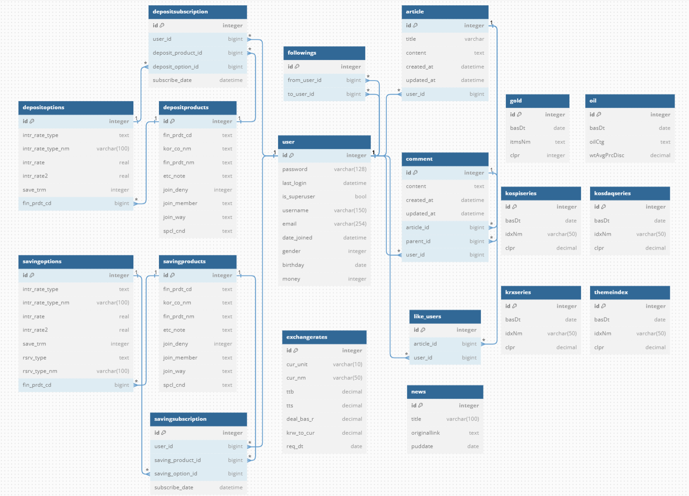

### ⏰ 개발기간

-   일시 : 2023.11.16(목) ~ 2023.11.23(목)

### **🤝 팀원**

| 이름   | 담당 영역                       | Github                       |
| ------ | ------------------------------- | ---------------------------- |
| 신현중 | 프론트엔드(Vue), CSS 작업       | https://github.com/Shin-3117 |
| 심상익 | 백엔드(Django), 프론트엔드(Vue) | https://github.com/sojugood  |

### 📃Description

-   투자를 위한 종합 정보 제공 애플리케이션 제작

### 🎯GOAL

-   금융상품 데이터 기반 예금 및 적금 금리 비교 서비스 구성
-   환율 정보 API를 활용한 환율 계산 서비스 구성
-   지도 API를 활용한 은행 검색 서비스 구성
-   일반상품시세(금, 석유) API를 활용한 차트 서비스 구성
-   주가지수시세(KOSPI, KOSDAQ, KRX, 테마) API를 활용한 차트 서비스 구성
-   일반상품 + 주가지수 시세 데이터를 활용한 특정 기간별 추세 분석을 활용한 투자 추천 알고리즘 구성
-   커뮤니티 서비스 구성
-   서비스 관리 및 유지보수 목표

### ✏️개발 계획

|                   | Front-End                                                    | Back-End                                                     |
| ----------------- | ------------------------------------------------------------ | ------------------------------------------------------------ |
| 메인 페이지       | - 7일간 KOSPI, KOSDAQ, 금, 석유 시세 변동을 보여주는 미니 차트 구현 - 주요 국가(미국, 일본) 환율 데이터 제공, 경제 뉴스 제공 | - 뉴스 API를 통한 기사 제목 및 링크 데이터 DB저장 및 프론트로 응답 |
| 회원 커스터마이징 | - 회원정보 수정 및 회원탈퇴                                  | 회원가입 및 로그인/로그아웃 기능                             |
| 예/적금 금리 비교 | - axios 활용하여 금융 상품 정보 가공 및 화면 구현 - 원하는 조건에 따른 상품 조회 기능 구현 - 상품 상세 정보 화면 구현 - axios 활용하여 관심상품 등록 기능 구현 - 예/적금 상세 페이지에 사용자 코멘트, 별점 기능 구현 | - API를 활용한 금융 상품 정보 DB 저장 - 관심상품 등록 기능 |
| 환율 계산기       | - axios 통신으로 응답받은 환율 정보 가공 및 화면 구현, 환율 계산기 기능 구현 | API를 활용한 환율 정보 DB 저장                               |
| 은행 검색 지도    | - API를 활용하여 Kakao 맵 화면 구현 - 키워드에 맞는 검색 결과 구현 - 카카오 맵 마커에 장소 정보 표시 | -                                                            |
| 커뮤니티          | - 게시판 CRUD 페이지 CSS - 글 작성 및 게시글 리스트 카테고리 표시  - 게시글 검색 기능 구현 | 게시글 및 댓글 CRUD 기능 구현                                |
| 프로필            | - 회원 프로필(이름/소개글 등) 수정 기능 구현  - 관심상품 조회 화면 구현 | 추천 금융상품 알고리즘 구현                                  |

### ✅필수 요구사항

| No.  | 구분                    | 기능                                                         | 구현 정도(⭐⭐⭐⭐⭐)   |
| ---- | ----------------------- | ------------------------------------------------------------ | ------------------ |
| 1    | 메인 페이지             | HomeView 구성                                                | ⭐⭐⭐⭐⭐              |
| 2    | 회원 커스터마이징       | 로그인/로그아웃 및 회원가입                                  | ⭐⭐⭐⭐               |
| 3    |                         | 네비게이션 가드 적용                                         | ⭐⭐⭐⭐⭐              |
| 4    | 금융상품조회            | 정기예금/정기적금 키워드 별 데이터 조회                      | ⭐⭐⭐                |
| 5    | 환율 계산기             | 당일 환율 데이터 조회 및 환율 변환 계산기 구현               | ⭐⭐⭐⭐               |
| 6    | 근처 은행 검색          | 카카오 맵을 활용하여 은행 위치 검색                          | ⭐⭐⭐⭐⭐              |
| 7    | 커뮤니티(게시판)        | 게시글 및 댓글 CRUD                                          | ⭐⭐⭐⭐⭐              |
| 8    | 프로필                  | 프로필 화면 관심상품 등록 리스트 유저가 쓴 게시글 리스트 추천 금융상품 목록 리스트 | ⭐⭐⭐ ⭐⭐⭐⭐ ⭐⭐⭐⭐ ⭐⭐⭐⭐ |
| 9    | 금융 상품 추천 알고리즘 | 유저별 금융상품 추천 알고리즘                                | ⭐⭐⭐                |

### 🛠Tech Stack

### 💠데이터베이스 모델링(ERD)

### 📚컴포넌트 구조

### 🧾개발일지

|          | 이진형                                                       | 박진희                                                       |
| -------- | ------------------------------------------------------------ | ------------------------------------------------------------ |
| 23-05-17 | - 프로젝트 구상 및 ERD, 컴포넌트 제작 - 카카오 맵, 금융상품 정보, 환율 API 테스트 - 로그인 및 회원가입 기능 구현 | - 프로젝트 컨셉 아이디어 회의 - 프로젝트 구상, 컴포넌트 기획 및 제작 - UI/UX에 맞는 메인 화면(HomeView) 와이어프레임 제작 |
| 23-05-18 | - 로그인, 회원가입 관련 디버깅 - 금융상품비교 화면 구현      | - HomeView CSS  - 부트스트랩을 이용한 캐러셀 제작  - 로그인, 회원가입 화면 구현( router-link 활용, - 회원가입 입력 정보 제작) 및 CSS |
| 23-05-19 | - 게시글 및 댓글 CRUD 구현 - 금융상품 검색 기능 구현         | - 회원가입 페이지 추가 정보 입력창 구현 - django template ⇒ vue views, component 옮기기 - 로그인/로그아웃에 따라 NavBar 구성 변경 - 로그인, 회원가입 모달창으로 만들기 시도 |
| 23-05-20 | - 중간 점검 및 계획 수정                                     | - 중간 점검 및 계획 수정                                     |
| 23-05-21 | - 환율 계산기 기능 구현 - 금융상품 각 상품별 옵션 정리       | - 프로필 페이지 컴포넌트 수정 및 CSS  - 프로필 이미지, 커버사진, 소개글 수정 기능 구현 시도  - 기타 동적 요소 구현할 수 있는 방법 고민 |
| 23-05-22 | - 카카오 맵 키워드 검색 결과 화면 구현                       | - FinanceView, 예금, 적금 컴포넌트에서 필요한 정보들만 화면에 표시되도록 구현(은행명, 상품명 등) - FinanceView 및 관련 컴포넌트 CSS |
| 23-05-23 | - 네비게이션 가드 설정 - 금융상품 비교 시 각 상품별 세전이자, 세후이자 계산식 적용 | - 금융 상품 리스트에서 상품명 클릭 시 페이지가 아닌 모달 창으로 구현 시도 |
| 23-05-24 | - 추천 금융상품 알고리즘 구현 - 프로필에 유저가 작성한 게시글 리스트 구현 | - MapView, CommunityView 및 관련 컴포넌트 CSS - 금융 상품 리스트 금액 단위 표시 구현 |
| 23-05-25 | - 발표 구상 및 준비 - 관심상품 등록 기능 구현 - CSS 보완     | - 발표 구상 및 준비 - CSS 보완                               |
| 23-05-26 | - 최종 점검 및 발표                                          | - 최종 점검 및 발표                                          |

### 🔥이슈 관리

| Name   | Content                                                      | **해결 여부**(Y/N) | **해결 과정**                                                |
| ------ | ------------------------------------------------------------ | ------------------ | ------------------------------------------------------------ |
| 이진형 | 댓글 작성자 출력 시도 중 IntegrityError 발생                 | Y                  | views.py에서 serializer.save() 진행 시 user=request.user를 추가하지 않았었음 |
|        | 비로그인 상태에서 로그인페이지 이동 시 간헐적으로 에러페이지가 반짝이는 현상 발생 | N                  | 네비게이션 가드 미적용이 원인인걸로 추정했으나 적용 이후에도 발생 → 원인을 찾지 못함 |
|        | 네비게이션 가드 설정 중 오류 발생                            | Y                  | store의 getters 메서드가 호출되지않아 오류가 뜸 → store를 import 하지 않아서 발생했던 문제였음 |
|        | 로그인 상태에서도 전역가드에 의해 접근이 막히는 현상 발생    | Y                  | 로그인이나 회원가입 이후 state가 최신화되지 않았음 → 페이지 새로고침(location.reload()) 활용하여 해결 |
|        | JPY 등 100 화폐단위 계산 시 맞는 값이 나오지 않음            | Y                  | method로 함수를 만들어 해결                                  |
| 박진희 | 하위 요소를 많이 만들다 보니 블록, 인라인 요소에 따른 정렬이 원하는 대로 나오지 않음 | Y                  | 관련 문법 다시 정리 후, 세부 컴포넌트 구조 그려가며 해결, style 태그에 style scoped 설정하여 해결 |
|        | api를 받아와 검색 조건에 따라 출력되는 리스트 길이가 달라 화면에 중첩되는 상황 발생 | Y                  | 좌측 검색필터, 지도 높이와 같은 높이를 지정 후, overflow-y = scroll 설정 |
|        | 로그인 시 아이디 저장 기능 구현 실패 (아이디 저장 체크박스 해제 시, 저장된 아이디 화면에서 제거, 체크되어 있고 아이디가 입력 되어 있으면 아이디 저장) | N                  | v-model 양방향 바인딩 설정 후, methods에서 if문, localStorage를 이용하여 아이디 저장 기능을 시도했으나 미해결 |
|        | 게시글 작성 시 카테고리를 추가 설정했으나, 게시글 목록 페이지에서 보이지 않음 | N                  | methods에서 카테고리 선택기능은 구현했으나, axios 요청 시 카테고리 전송 데이터 처리의 문제인지 문제의 원인조차 파악이 어려웠음 |

### 🪢서비스 구현

| No   | 구분              | 기능                                                         | 구현 정도(⭐⭐⭐⭐⭐)                                        |
| ---- | ----------------- | ------------------------------------------------------------ | ------------------------------------------------------- |
| 1    | 메인 페이지       | 메인페이지 레이아웃 및 디자인 CSS                            | ⭐⭐⭐⭐⭐                                                   |
| 2    |                   | 최신 금융 뉴스 볼 수 있도록 데이터 크롤링                    | 미구현                                                  |
| 3    | 회원 커스터마이징 | 회원가입 및 로그인/로그아웃 기능                             | ⭐⭐⭐⭐                                                    |
| 4    |                   | 회원가입 및 로그인/로그아웃 화면 구현                        | ⭐⭐⭐⭐                                                    |
| 5    |                   | 회원/비회원에 따라 보이는 화면 다르게 나타나도록 구현        | ⭐⭐⭐⭐⭐                                                   |
| 6    |                   | 사용자 편의를 위한 아이디 저장 기능                          | 미구현                                                  |
| 7    | 예/적금 금리 비교 | API를 활용한 금융 상품 정보 DB 저장                          | ⭐⭐⭐⭐⭐                                                   |
| 8    |                   | 관심상품 등록 기능                                           | ⭐⭐⭐⭐⭐                                                   |
| 9    |                   | 회원가입 시 입력받은 정보를 기반으로 한 상품 추천 알고리즘 계획 | 미구현(랜덤으로 대체)                                   |
| 10   |                   | axios 활용하여 금융 상품 정보 가공 및 화면 구현              | ⭐⭐⭐⭐⭐                                                   |
| 11   |                   | 상품 상세 정보 화면 구현                                     | ⭐⭐⭐⭐(디자인이 살짝 아쉬움)                              |
| 12   |                   | axios 활용하여 관심상품 등록 기능 구현                       | ⭐⭐⭐⭐⭐                                                   |
| 13   |                   | 예/적금 상세 페이지에 사용자 코멘트, 별점 기능 구현          | 미구현                                                  |
| 14   |                   | 카테고리별 검색 기능                                         | ⭐⭐⭐(검색 카테고리 화면만 구현하고 기능을 추가하지 못함) |
| 15   | 환율 계산기       | API를 활용한 환율 정보 DB 저장                               | ⭐⭐⭐⭐(비영업일 데이터를 받지 못함)                       |
| 16   |                   | axios 활용하여 환율 정보 가공 및 화면 구현                   | ⭐⭐⭐⭐                                                    |
| 17   |                   | 환율 계산기 기능 구현                                        | ⭐⭐⭐⭐                                                    |
| 18   | 은행 검색 지도    | API를 활용하여 Kakao 맵 화면 구현                            | ⭐⭐⭐⭐⭐                                                   |
| 19   |                   | 키워드에 맞는 검색 결과 구현                                 | ⭐⭐⭐⭐⭐                                                   |
| 20   |                   | 카카오 맵 마커에 장소 정보 표시                              | ⭐⭐⭐⭐                                                    |
| 21   | 커뮤니티          | 게시글 및 댓글 CRUD 기능 구현                                | ⭐⭐⭐⭐⭐                                                   |
| 22   |                   | 게시판 CRUD 페이지 CSS                                       | ⭐⭐⭐⭐⭐                                                   |
| 23   |                   | 글 작성 및 게시글 리스트 카테고리 표시                       | 미구현                                                  |
| 24   |                   | 게시글 검색 기능 구현                                        | 미구현                                                  |
| 25   | 프로필            | 추천 금융상품 알고리즘 구현                                  | ⭐⭐⭐(랜덤으로 대체)                                      |
| 26   |                   | 회원 프로필(이름/소개글 등) 수정 기능 구현                   | 미구현                                                  |
| 27   |                   | 관심상품 조회 화면 구현                                      | ⭐⭐⭐⭐(디자인 아쉬움)                                     |
| 28   |                   | 작성한 게시글 조회                                           | ⭐⭐⭐⭐(디자인 아쉬움)                                     |

### 🍀 배운점 및 느낀점