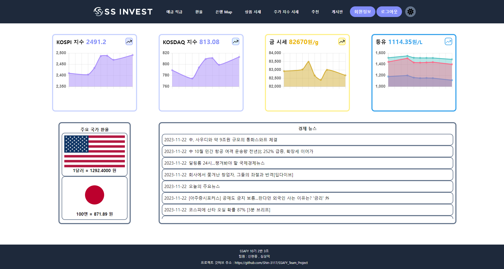

# Simple Support INVEST
투자를 위한 종합 정보 제공 사이트입니다.

## ⏰ 개발기간

-   일시 : 2023.11.16(목) ~ 2023.11.23(목)

## **🤝 팀원**

| 이름   | 담당 영역                       | Github                       |
| ------ | ------------------------------- | ---------------------------- |
| 신현중 | 프론트엔드(Vue)       | https://github.com/Shin-3117 |
| 심상익 | 백엔드(Django), 프론트엔드(Vue) | https://github.com/sojugood  |

## 🎯GOAL

-   금융상품 데이터 기반 예금 및 적금 금리 비교 서비스 구성
-   환율 정보 API를 활용한 환율 계산 서비스 구성
-   지도 API를 활용한 은행 검색 서비스 구성
-   일반상품시세(금, 석유) API를 활용한 차트 서비스 구성
-   주가지수시세(KOSPI, KOSDAQ, KRX, 테마) API를 활용한 차트 서비스 구성
-   일반상품 + 주가지수 시세 데이터를 활용한 특정 기간별 추세 분석을 활용한 투자 추천 알고리즘 구성
-   커뮤니티 서비스 구성

## ✏️개발 계획

|                   | Front-End                                                    | Back-End                                                     |
| ----------------- | ------------------------------------------------------------ | ------------------------------------------------------------ |
| 메인 페이지       | - 7일간 KOSPI, KOSDAQ, 금, 석유 시세 변동을 보여주는 미니 차트 구현 - 주요 국가(미국, 일본) 환율 데이터 제공, 경제 뉴스 제공 | - 뉴스 API를 통한 기사 제목 및 링크 데이터 DB저장 및 프론트로 응답 |
| 회원 인증 | - 회원가입 및 로그인 기능  - 로그인 상태에 따른 컴포넌트 관리               | 회원가입 및 로그인/로그아웃 기능                             |
| 예/적금 금리 비교 | - axios 활용하여 금융 상품 정보 가공 및 화면 구현  - 원하는 조건에 따른 상품 조회 기능 구현  - 상품 상세 정보 모달 구현  - 금융 상품 즐겨찾기 기능 구현 | - API를 활용한 금융 상품 정보 DB 저장 - 관심상품 등록 기능 |
| 환율 계산기       | - axios 통신으로 응답받은 환율 정보 가공 및 화면 구현, 환율 계산기 기능 구현 | API를 활용한 환율 정보 DB 저장                               |
| 은행 검색 지도    | - API를 활용하여 Kakao 맵 화면 구현  - 위치에 있는 은행 검색 결과 구현  - 카카오 맵 마커에 장소 정보 표시 | -                                                            |
| 커뮤니티          | - 게시판, 댓글, 대댓글 CRUD 구현  - 글 작성 및 게시글 리스트 카테고리 표시 | 게시글 및 댓글 CRUD 기능 구현                                |
| 추천            | 추천 기능 구현 | 추천 금융상품 알고리즘 구현                                  |

## ✅필수 요구사항

| No.  | 구분                    | 기능                                                         | 구현 정도|
| --- | ----------------------- | ------------------------------------------------------------ | --------------------------------- |
| 1   | 메인 페이지             | HomeView 구성                                                | 기능 구현 및  css 완료              |
| 2   | 회원 기능               | 로그인/로그아웃 및 회원가입                                  | 기능 구현 및 css 완료             |
| 3   | 금융상품조회            | 정기예금/정기적금 키워드 별 데이터 조회                      | 기능 구현 및 css 완료                |
| 4   | 환율 계산기             | 당일 환율 데이터 조회 및 환율 변환 계산기 구현               | 기능 구현 및 css 완료               |
| 5   | 근처 은행 검색          | 카카오 맵 API를 활용하여 은행 위치 검색                         | 기능 구현 및 css 완료              |
| 6   | 게시판                 | 게시글 및 댓글, 좋아요, 팔로우 CRUD                         | 기능 구현 및 css 완료              |
| 7   | 프로필                  | - 회원 정보  - 관심상품 등록 리스트  - 유저가 쓴 게시글, 댓글 리스트 리스트 | 기능 구현 완료 및 css 완료 |
| 8   | 금융 상품 추천 알고리즘 | 금융상품 추천 알고리즘                                | 기능 구현 및 css 완료               |

### 🛠Tech Stack

### 💠데이터베이스 모델링(ERD)

### 📚컴포넌트 구조

### 🧾개발일지
#### 신현중
[개발일지 상세](./Front-end/Shin.md)
- 2023.11.13 카카오 맵 API, Vue3 연동
- 2023.11.14 은행 예적금 Data를 서버에 저장후, 프론트 통신
- 2023.11.15 로그인 토큰 처리, 환율 기능 세팅
- 2023.11.16 회원가입 입력정보 수정, 카카오맵 api으로 은행 검색 기능 구현
- 2023.11.17 게시판, 댓글 기능 구현
- 2023.11.18 유저 팔로우 기능 구현, 게시판 작성시간 추가
- 2023.11.19 세션 스토리지에 토큰 저장 기능 구현
- 2023.11.20 게시판 좋아요 기능 구현, 예적금 페이지 페이지네이션, 예적금 즐겨찾기 기능 구현
- 2023.11.21 예적금 즐겨찾기 기능 캐싱 처리, 게시글 좋아요 토글 처리
- 2023.11.22 css 작업
- 2023.11.23 css 작업, 컴포넌트 구조도 제작
- README.md 정리

### 🔥이슈 관리

| Name   | Content                                                                                      | **해결 여부**(Y/N) | **해결 과정**                                                                                                   |
| ------ | -------------------------------------------------------------------------------------------- | ------------------ | --------------------------------------------------------------------------------------------------------------- |
| 신현중 | 카카오 맵 API 공식 문서의 예시가 바닐라 자바스크립트만 존재, 작업환경인 Vue3와 차이점이 있음 | Y                  | Vue3문법으로 작성된 글은 없어 Vue2문법으로 작성된 코드를 이용하여 Vue3로 변경                                   |
| 신현중 | 카카오 맵 API CORS 오류                                                                      | Y                  | 카카오 API 설정에서 도메인 주소 localhost:5173 (Vue), localhost:5050 (live server)를 추가하여 해결 |
|        | 카카오 맵 API에서 검색 기능을 실행할 때마다, 겹쳐져서 카카오 맵이 생성됨                     | Y                  | 공식문서에서 권장하는 대로 초기에 카카오 맵 한개만 생성하고 맵을 조정하는 방향으로 변경                         |
|        | 카카오 맵 API에서 검색 기능을 실행할 때마다, 마커가 삭제되지 않고 계속 생성됨                | Y                  | 마커를 list에 관리하여, 검색시 기존의 마커를 삭제하도록 수정                                                    |
|        | 새로고침 시, 로그아웃 됨                                                                     | Y                  | Pinia가 새로고침 되면서 Store에 관리하는 토큰이 사라져서 문제 발생, SecctionStorage에 토큰을 저장하여 문제 해결 |
|        | 예적금 즐겨찾기 후, 예적금 Data가 최신화가 되자 않음                                         | Y                  | 캐싱으로 발생한 문제로, 캐싱을 해제하기 위해 Axios로 통신시 path정보를 추가하여 즐겨찾기 요청                   |

### 서비스 구현

| No  | 구분              | 기능                                                  | 구현 정도(⭐⭐⭐⭐⭐)   |
| --- | ----------------- | ----------------------------------------------------- | ----------------------- |
| 1   | 메인 페이지       | 메인페이지 레이아웃 및 디자인 CSS                     | ⭐⭐⭐⭐⭐              |
| 2   |                   | 최신 금융 뉴스 볼 수 있도록 네이버 API 사용           | ⭐⭐⭐⭐⭐              |
| 3   | 회원 커스터마이징 | 회원가입 및 로그인/로그아웃 기능                      | ⭐⭐⭐⭐                |
| 4   |                   | 회원가입 및 로그인/로그아웃 화면 구현                 | ⭐⭐⭐⭐⭐              |
| 5   |                   | 회원/비회원에 따라 보이는 화면 다르게 나타나도록 구현 | ⭐⭐⭐⭐⭐              |
| 6   |                   | 회원 탈퇴, 회원 팔로우                                | ⭐⭐⭐                  |
| 7   | 예/적금 금리 비교 | API를 활용한 금융 상품 정보 DB 저장                   | ⭐⭐⭐⭐⭐              |
| 8   |                   | 관심상품 등록 기능                                    | ⭐⭐⭐⭐⭐              |
| 9   |                   | 입력받는 예적금 DATA 수량 조절 (페이지당 20개)        | ⭐⭐⭐⭐⭐              |
| 10  |                   | axios 활용하여 금융 상품 정보 가공 및 화면 구현       | ⭐⭐⭐⭐⭐              |
| 11  |                   | 상품 상세 정보 화면 구현                              | ⭐⭐⭐⭐                |
| 12  |                   | axios 활용하여 관심상품 등록 기능 구현                | ⭐⭐⭐⭐⭐              |
| 13  |                   | 예/적금 즐겨찾기 기능 구현                            | ⭐⭐⭐⭐⭐              |
| 14  |                   | 카테고리별 검색 기능                                  | ⭐⭐⭐⭐⭐              |
| 15  | 환율 계산기       | API를 활용한 환율 정보 DB 저장                        | ⭐⭐⭐⭐⭐              |
| 16  |                   | axios 활용하여 환율 정보 가공 및 화면 구현            | ⭐⭐⭐⭐                |
| 17  |                   | 환율 계산기 기능 구현                                 | ⭐⭐⭐⭐                |
| 18  | 은행 검색 지도    | API를 활용하여 Kakao 맵 화면 구현                     | ⭐⭐⭐⭐⭐              |
| 19  |                   | 은행 태그에 맞는 검색 결과 구현                       | ⭐⭐⭐⭐⭐              |
| 20  |                   | 카카오 맵 마커에 장소 정보 표시                       | ⭐⭐⭐⭐⭐              |
| 21  | 커뮤니티          | 게시글 및 댓글 CRUD 기능 구현                         | ⭐⭐⭐⭐⭐              |
| 22  |                   | 게시판 CRUD 페이지 CSS                                | ⭐⭐⭐⭐⭐              |
| 23  |                   | 글 작성 및 게시글 리스트 카테고리 표시                | 미구현                  |
| 24  |                   | 게시글 검색 기능 구현                                 | 미구현                  |
| 25  | 프로필            | 추천 금융상품 알고리즘 구현                           | ⭐⭐⭐(랜덤으로 대체)   |
| 26  |                   | 회원 프로필(이름/소개글 등) 수정 기능 구현            | 미구현                  |
| 27  |                   | 관심상품 조회 화면 구현                               | ⭐⭐⭐⭐(디자인 아쉬움) |
| 28  |                   | 작성한 게시글 조회                                    | ⭐⭐⭐⭐(디자인 아쉬움) |

### 🍀 배운점 및 느낀점